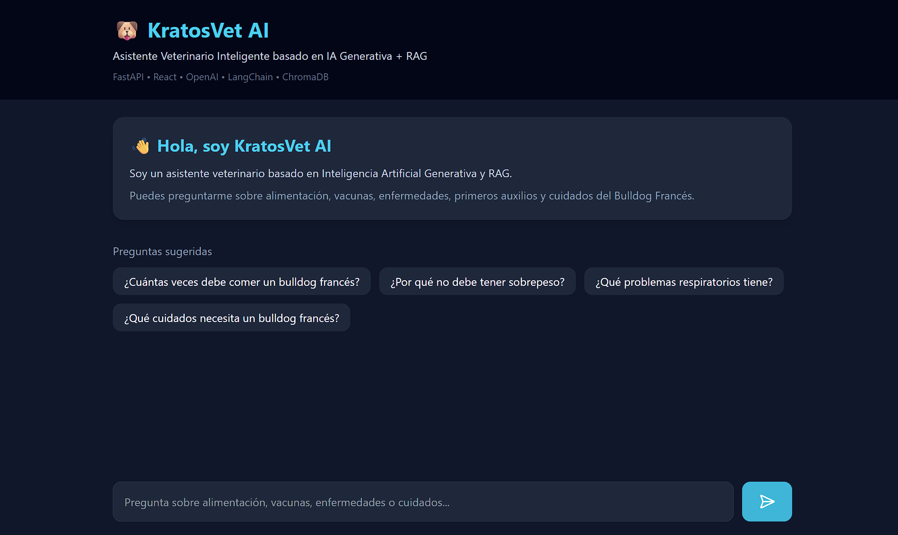
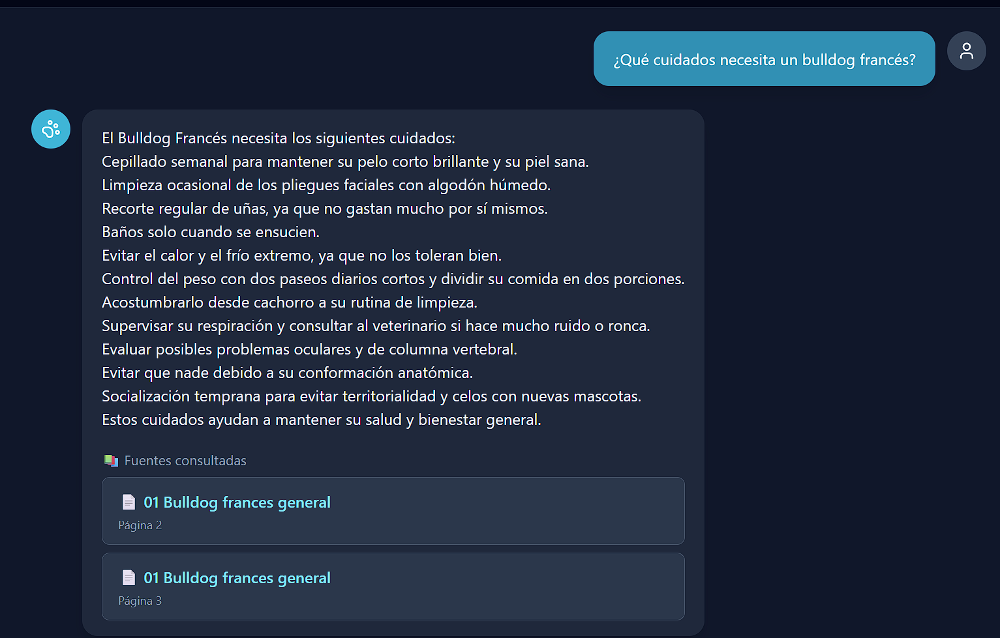

# 🐶 KratosVet AI

Asistente Veterinario Inteligente especializado en perros, desarrollado como proyecto final del **Diplomado en IA Generativa** de la **Universidad de La Sabana**.

KratosVet AI utiliza un sistema **RAG (Retrieval-Augmented Generation)** para responder preguntas utilizando información proveniente de documentos veterinarios reales sobre salud, nutrición y cuidados caninos, especialmente del Bulldog Francés.

---

# 🚀 Tecnologías utilizadas

## Backend

- FastAPI
- LangChain
- OpenAI GPT-4o Mini
- OpenAI Embeddings
- ChromaDB
- Pydantic
- Python 3.14

## Frontend

- React
- Vite
- Tailwind CSS
- Axios
- React Markdown
- Lucide React

---

# 🏗 Arquitectura

```
Usuario
    │
    ▼
React Frontend
    │
Axios
    │
    ▼
FastAPI
    │
RAG Service
    │
Retriever
    │
ChromaDB
    │
Embeddings OpenAI
    │
Documentos PDF
    │
GPT-4o Mini
    │
Respuesta + Fuentes
```

---

# 📂 Estructura del proyecto

```
KratosVetAI/

│
├── backend/
│   ├── app/
│   │   ├── api/
│   │   ├── core/
│   │   ├── rag/
│   │   │   ├── embeddings/
│   │   │   ├── loaders/
│   │   │   ├── retriever/
│   │   │   ├── splitter/
│   │   │   ├── vectorstore/
│   │   │   └── services/
│   │   ├── schemas/
│   │   └── services/
│   │
│   ├── data/
│   │   ├── documents/
│   │   └── chroma_db/
│   │
│   ├── scripts/
│   ├── requirements.txt
│   └── .env.example
│
├── frontend/
│   ├── src/
│   │   ├── components/
│   │   ├── hooks/
│   │   ├── pages/
│   │   └── services/
│   │
│   └── package.json
│
└── README.md
```

---

# ⚙ Instalación

## 1. Clonar el repositorio

```bash
git clone https://github.com/jonnathanpachon97/kratosvet-ai.git

cd kratosvet-ai
```

---

## Backend

Crear entorno virtual

```bash
python -m venv .venv
```

Activar entorno

Windows

```bash
.venv\Scripts\activate
```

Instalar dependencias

```bash
pip install -r requirements.txt
```

Crear el archivo

```
backend/.env
```

a partir de

```
backend/.env.example
```

Agregar la API Key de OpenAI.

---

### Construir la base vectorial

```bash
python -m scripts.build_vector_db
```

---

### Ejecutar Backend

```bash
uvicorn app.main:app --reload
```

Backend disponible en

```
http://127.0.0.1:8000
```

Documentación Swagger

```
http://127.0.0.1:8000/docs
```

---

## Frontend

Entrar a la carpeta

```bash
cd frontend
```

Instalar dependencias

```bash
npm install
```

Ejecutar

```bash
npm run dev
```

Disponible en

```
http://localhost:5173
```

---

# 📚 Base documental

Actualmente el proyecto contiene documentación veterinaria especializada utilizada para construir la base vectorial mediante embeddings.

Proceso:

- Carga de PDFs
- División en chunks
- Generación de embeddings
- Almacenamiento en ChromaDB
- Recuperación semántica
- Generación de respuesta mediante GPT

---

# ✨ Funcionalidades

- Chat veterinario especializado.
- Recuperación semántica mediante RAG.
- Respuestas basadas únicamente en la documentación.
- Visualización de fuentes utilizadas.
- Preguntas rápidas.
- Interfaz moderna en React.
- Markdown en respuestas.
- Auto Scroll.
- Indicador de carga.
- Historial de conversación durante la sesión.

---

# 📸 Capturas

## Pantalla principal



---

## Respuesta con fuentes



---

# 👨‍💻 Autor

**Jonnathan Pachón**

Proyecto Final

Diplomado IA Generativa

Universidad de La Sabana

2026